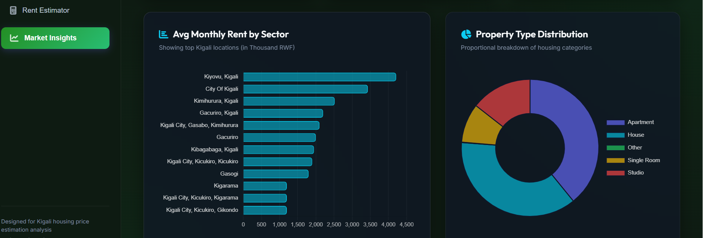
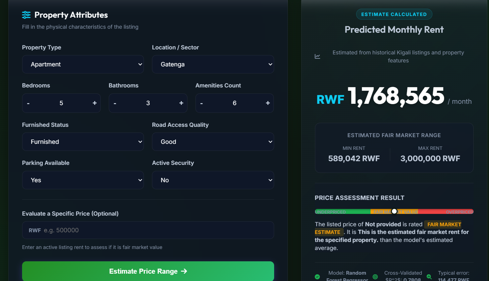

# Kigali Rental Price Estimation System

A machine learning web application that predicts fair rental prices for residential properties in Kigali, Rwanda. The system uses historical rental data and a trained Random Forest regressor to estimate monthly rent and evaluate whether a listed price is underpriced, fair, or overpriced.

## Live Links
- Live app: https://kigali-rental-price-estimator.onrender.com
- Demo video: 
- GitHub repository: https://github.com/Uwingabir/kigali-rental-price-estimator.git

## Screenshot Evidence
Below are the two key screenshots that should display directly in the README once the image files are added to the repository.





Please save your screenshots as:
- `screenshots/demo-1.png` — estimator form before prediction
- `screenshots/demo-2.png` — prediction result with fair market range and price assessment

These images will then appear immediately in the README, without requiring a click.

## Project Goal
This project was developed to solve a real-world problem in the Kigali housing market: rental prices are often inconsistent and difficult to evaluate. The web app gives tenants, landlords, and agents a data-driven way to estimate market value.

## Core Functionalities
- Property rent estimation from user input
- Price evaluation against a predicted fair market range
- Market insights dashboard with rental statistics and charts
- **Contact Commissioner Form**: Pre-filled with estimated property parameters and sends a direct WhatsApp notification to the commissioner
- **Commissioner Dashboard**: Gated by a security PIN, allowing commissioners to view and manage in-app inquiry records
- Responsive web interface for easy use on desktop and mobile

## Technologies Used
- Python
- Flask
- scikit-learn
- pandas / NumPy
- joblib
- Twilio WhatsApp API (for commissioner notifications)
- python-dotenv
- HTML, CSS (Vanilla), JavaScript
- Chart.js
- Render for deployment

## Installation and Run Instructions
1. Clone the repository:
   ```bash
   git clone https://github.com/Uwingabir/kigali-rental-price-estimator.git
   cd kigali-rental-price-estimator
   ```
2. Create and activate a virtual environment:
   ```bash
   python -m venv venv
   venv\Scripts\activate
   ```
3. Install dependencies:
   ```bash
   pip install -r requirements.txt
   ```
4. Configure environment variables (Optional - for WhatsApp alerts):
   - Copy `.env.template` to `.env`
   - Fill in your Twilio Account SID, Auth Token, Sender number, and recipient Commissioner WhatsApp number.
   - If not configured, the app will run with local JSON inquiry logging only (graceful fallback).
5. Train the model and generate market statistics:
   ```bash
   python train_model.py
   ```
6. Run the app locally:
   ```bash
   python app.py
   ```

## Testing Strategies and Results
The application was tested using multiple validation strategies and supporting screenshots/demo evidence.

### 1. Functional testing
- Demonstrated the full prediction workflow from form input to prediction output on the live deployed app.
- Confirmed that the app returns a rent estimate, a fair market range, and a clear price assessment status.
- Screenshots/demo evidence should show the estimator form, prediction results, and the assessment section in action.

### 2. Input variation testing
- Tested the app with different values such as:
  - different bedroom and bathroom counts
  - different property types and locations
  - different furnished and security conditions
  - optional listed prices to trigger Underpriced / Fair Market / Overpriced results
- Verified that the output changes sensibly according to the input and that the assessment logic responds correctly.
- Screenshots/demo evidence should include at least one example with a normal estimate and one with a listed price comparison.

### 3. Performance and environment check
- Verified that the application loads successfully with the required Python packages.
- Verified that the trained model file exists and loads successfully as a scikit-learn pipeline.
- Confirmed the deployed app responds correctly on the target environment and returns valid prediction JSON.

### Verification evidence
The following checks were run successfully during validation:
- Python imports for Flask, pandas, scikit-learn, and joblib completed successfully.
- The model file was confirmed to exist and load successfully.
- The deployed app returned valid prediction responses for multiple sample inputs.
- The app was verified on the live Render deployment and locally through the Flask app.

### Screenshots / Demo Evidence Expected for Submission
- Screenshot 1: Home page showing the estimator form and input fields.
- Screenshot 2: Prediction result showing predicted rent and fair market range.
- Screenshot 3: Price comparison assessment showing Underpriced / Fair Market / Overpriced behavior.
- Screenshot 4: Market Insights view showing charts and dataset statistics.

## Analysis of Results
The results show that the project met its main objective of creating a practical rental-price estimation tool. The model is able to generate predictions based on property features and provide users with a clear market comparison. The app also demonstrates that machine learning can be applied to a real social and economic problem in Kigali.

## Discussion of Milestones and Impact
The main milestones completed were:
- Data preparation and cleaning
- Model training and evaluation
- Web application development
- Deployment and testing

The impact of the project is that it simplifies rental pricing decisions for users who may otherwise rely on guesswork or informal market knowledge. It supports more transparent and informed decision-making.

## Recommendations and Future Work
- Add more data from additional Kigali locations and newer listings
- Improve model explainability with feature-importance visualization
- Add more advanced analytics such as trend forecasting and neighborhood comparison
- Extend the app with user authentication and saved property history

## Repository Structure
- app.py - Flask backend and prediction API
- train_model.py - Model training and serialization
- templates/ - Web interface files
- static/ - CSS and JavaScript assets
- best_model.joblib - Trained machine learning model
- market_stats.joblib - Cached market statistics
- test_api.py - Basic API testing script


CASE 1 (no listed_rent provided):
{
  "listed_rent": null,
  "model_mae": 114477,
  "predicted_rent": 634424,
  "price_diff_percent": 0.0,
  "price_status": "Fair Market",
  "rent_max": 748901,
  "rent_min": 519947,
  "status": "success"
}

CASE 2 (listed_rent=900000, House, Remera):
{
  "listed_rent": 900000.0,
  "model_mae": 114477,
  "predicted_rent": 1046219,
  "price_diff_percent": -14.0,
  "price_status": "Underpriced",
  "rent_max": 1160696,
  "rent_min": 931742,
  "status": "success"
}

CASE 3 (listed_rent=300000, Studio, Gikondo):
{
  "listed_rent": 300000.0,
  "model_mae": 114477,
  "predicted_rent": 154524,
  "price_diff_percent": 94.1,
  "price_status": "Overpriced",
  "rent_max": 269001,
  "rent_min": 40047,
  "status": "success"
}
```

- **Evidence Summary:** The live API returned valid predictions, reasonable fair-market ranges, and correct `price_status` assessments when `listed_rent` was provided (Underpriced / Overpriced / Fair Market). 